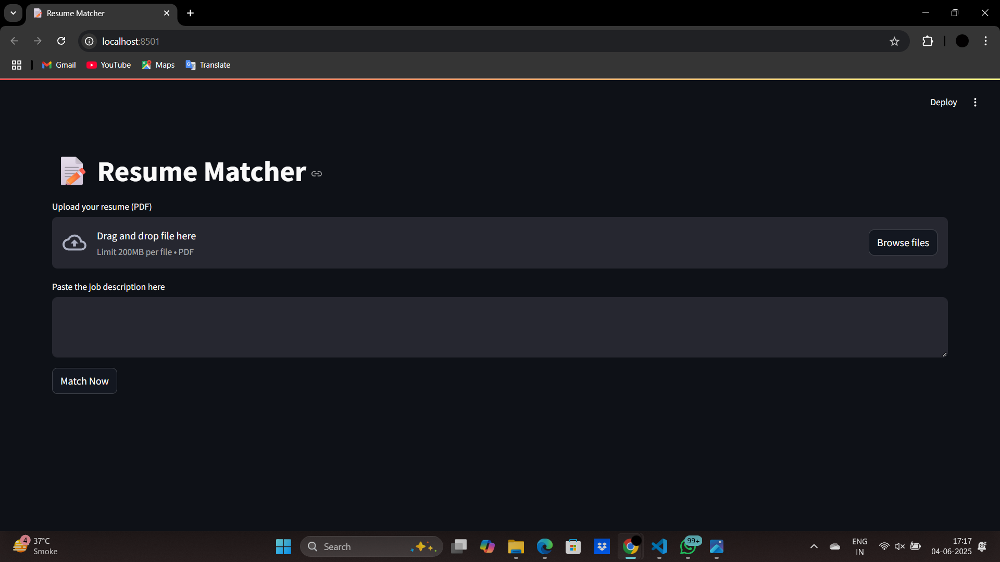
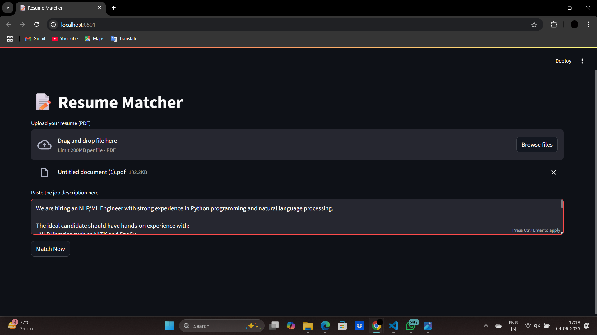
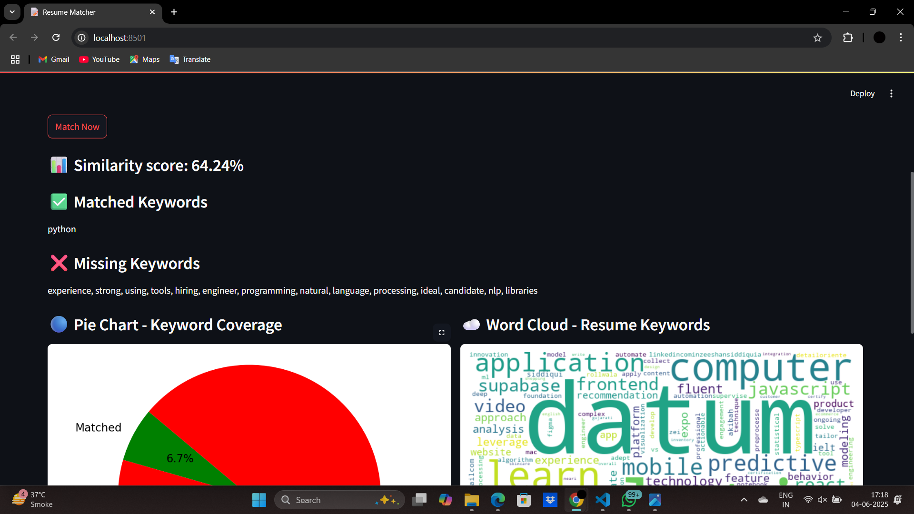
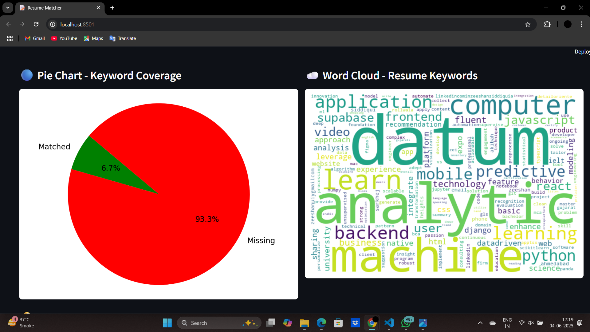
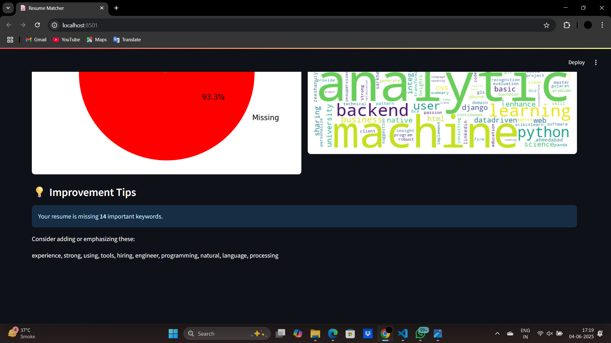

# 📝 Resume Matcher

A smart, ML-powered resume matcher that compares your resume to a job description and gives you actionable feedback using semantic similarity and keyword matching.

---

## 🚀 Features

- 📄 **PDF Resume Upload**  
  Upload your resume in PDF format directly via the app.

- 🧠 **Semantic Similarity Scoring**  
  Uses transformer-based models (`SentenceTransformer`) to compare your resume and job description meaningfully—not just keyword counts.

- 🔍 **Keyword Matching**  
  Identifies key terms from the job description that are either **matched** or **missing** in your resume.

- 📊 **Visual Insights**  
  - **Pie Chart** showing matched vs missing keywords.  
  - **Word Cloud** of dominant keywords in your resume.

- 💡 **Improvement Suggestions**  
  Automatically highlights top missing terms to help you refine your resume.

---

## 🖼️ Screenshots

| Resume Upload & Job Description Input | 
|--------------------------------------|
|                       |
|                       |
|                       |                 
|                       |                 
|                       |                 

---

## 🧪 Usage Modes

### 1. 🎯 Streamlit App
Interactive web-based app with visual feedback.

streamlit run app.py
### 2. 📁 Batch Matching (CLI)
Run resume-to-job matching for a folder of resumes.

python batch_matcher.py resumes/ job_description.txt

### 3. Command Line Tool
Simple resume-vs-job match for single files.

python cli.py my_resume.pdf job_description.txt

🧰 Tech Stack
Python

Streamlit

NLTK, SpaCy

Sentence-Transformers for semantic similarity

Matplotlib, WordCloud for visualizations

PyMuPDF (fitz) for PDF parsing 
